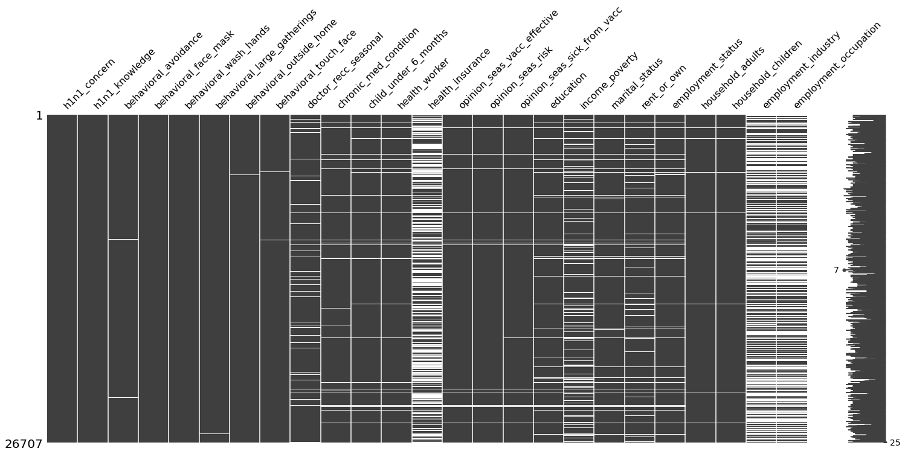
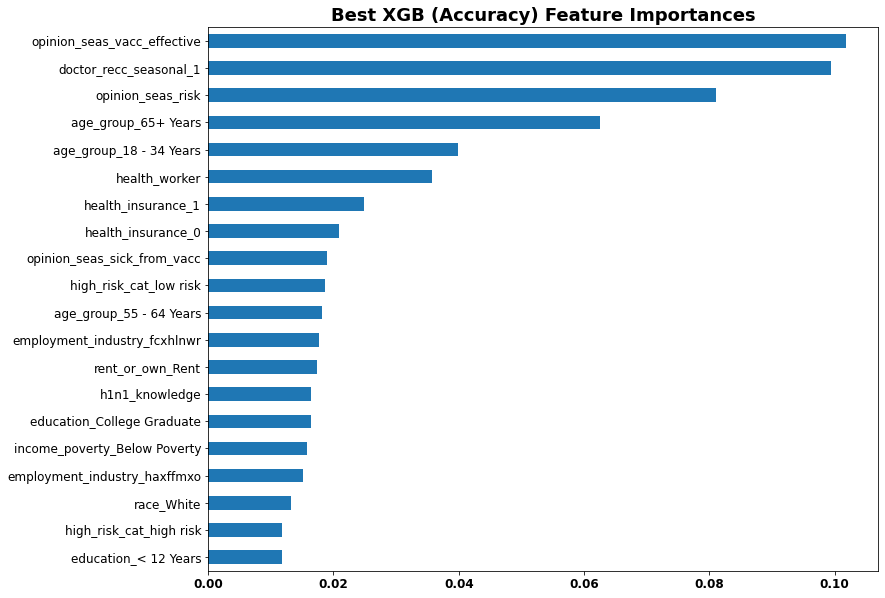
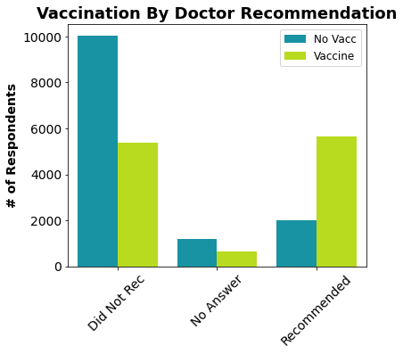
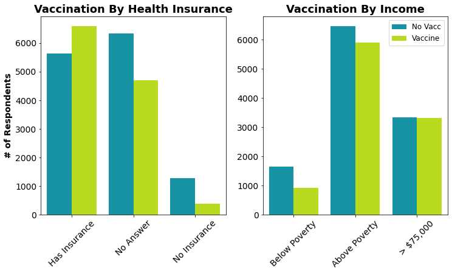
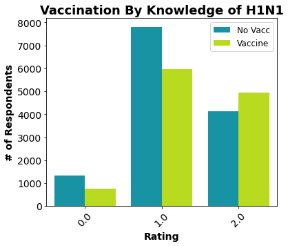
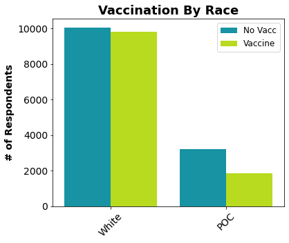

# Mod 3 Final Project - 
# Predicting Seasonal Flu Vaccination Status During the 2009 H1N1 Pandemic

#### Author: Max Steele

The goal of this project was to build a classifier to predict whether someone was vaccinated against the seasonal flu or not as accurately as possible, while maximizing recall of those that elect not to get the vaccine. The main purposes of this modeling effort is to provide insight into:
 - factors that influence whether someone elects to get vaccinated against the seasonal flu, and 
 - which subsets of the population pro-vaccine campaigns should target when hoping to increase the total number of people receiving the vaccine each year.

## Data
The data used were obtained from <a href="https://www.drivendata.org/competitions/66/flu-shot-learning/page/211/"> DrivenData</a> (<a href="https://www.cdc.gov/nchs/nis/data_files_h1n1.htm">Source</a>: CDC, NCRID and NCHS (2012), National 2009 H1N1 Flu Survey). The dataset contains the following columns/ information: 
* **h1n1_vaccine** - Whether respondent received H1N1 flu vaccine.
* **seasonal_vaccine** - Whether respondent received seasonal flu vaccine.
* **h1n1_concern** - Level of concern about the H1N1 flu.
0 = Not at all concerned; 1 = Not very concerned; 2 = Somewhat concerned; 3 = Very concerned.
* **h1n1_knowledge** - Level of knowledge about H1N1 flu.
0 = No knowledge; 1 = A little knowledge; 2 = A lot of knowledge.
* **behavioral_antiviral_meds** - Has taken antiviral medications. (binary)
* **behavioral_avoidance** - Has avoided close contact with others with flu-like symptoms. (binary)
* **behavioral_face_mask** - Has bought a face mask. (binary)
* **behavioral_wash_hands** - Has frequently washed hands or used hand sanitizer. (binary)
* **behavioral_large_gatherings** - Has reduced time at large gatherings. (binary)
* **behavioral_outside_home** - Has reduced contact with people outside of own household. (binary)
* **behavioral_touch_face** - Has avoided touching eyes, nose, or mouth. (binary)
* **doctor_recc_h1n1** - H1N1 flu vaccine was recommended by doctor. (binary)
* **doctor_recc_seasonal** - Seasonal flu vaccine was recommended by doctor. (binary)
* **chronic_med_condition** - Has any of the following chronic medical conditions: asthma or an other lung condition, diabetes, a heart condition, a kidney condition, sickle cell anemia or other anemia, a neurological or neuromuscular condition, a liver condition, or a weakened immune system caused by a chronic illness or by medicines taken for a chronic illness. (binary)
* **child_under_6_months** - Has regular close contact with a child under the age of six months. (binary)
* **health_worker** - Is a healthcare worker. (binary)
* **health_insurance** - Has health insurance. (binary)
* **opinion_h1n1_vacc_effective** - Respondent's opinion about H1N1 vaccine effectiveness.
1 = Not at all effective; 2 = Not very effective; 3 = Don't know; 4 = Somewhat effective; 5 = Very effective.
* **opinion_h1n1_risk** - Respondent's opinion about risk of getting sick with H1N1 flu without vaccine.
1 = Very Low; 2 = Somewhat low; 3 = Don't know; 4 = Somewhat high; 5 = Very high.
* **opinion_h1n1_sick_from_vacc** - Respondent's worry of getting sick from taking H1N1 vaccine.
1 = Not at all worried; 2 = Not very worried; 3 = Don't know; 4 = Somewhat worried; 5 = Very worried.
* **opinion_seas_vacc_effective** - Respondent's opinion about seasonal flu vaccine effectiveness.
1 = Not at all effective; 2 = Not very effective; 3 = Don't know; 4 = Somewhat effective; 5 = Very effective.
* **opinion_seas_risk** - Respondent's opinion about risk of getting sick with seasonal flu without vaccine.
1 = Very Low; 2 = Somewhat low; 3 = Don't know; 4 = Somewhat high; 5 = Very high.
* **opinion_seas_sick_from_vacc** - Respondent's worry of getting sick from taking seasonal flu vaccine.
1 = Not at all worried; 2 = Not very worried; 3 = Don't know; 4 = Somewhat worried; 5 = Very worried.
* **age_group** - Age group of respondent.
* **education** - Self-reported education level.
* **race** - Race of respondent.
* **sex** - Sex of respondent.
* **income_poverty** - Household annual income of respondent with respect to 2008 Census poverty thresholds.
* **marital_status** - Marital status of respondent.
* **rent_or_own** - Housing situation of respondent.
* **employment_status** - Employment status of respondent.
* **hhs_geo_region** - Respondent's residence using a 10-region geographic classification defined by the U.S. Dept. of Health and Human Services. Values are represented as short random character strings.
* **census_msa** - Respondent's residence within metropolitan statistical areas (MSA) as defined by the U.S. Census.
* **household_adults** - Number of other adults in household, top-coded to 3.
* **household_children** - Number of children in household, top-coded to 3.
* **employment_industry** - Type of industry respondent is employed in. Values are represented as short random character strings.
* **employment_occupation** - Type of occupation of respondent. Values are represented as short random character strings.

Regarding the target variable `seasonal_vaccine`, the classes were relatively balanced, with 46.9% of respondents being vaccinated and 53.1% not receiving the seasonal flu vaccine during the survey year (2009).


## Methods
I followed the OSEMN data science process to approach this problem. Initial exploration of the dataset identified and dealt with null or otherwise missing values as well as potentially useful features that could be engineered from the existing data. 


### Missing Values

Several columns were identified as having at least some missing values. Because the full dataset is quite large (26,707 observations) and most columns have very few missing values overall, records were dropped if they were missing information in any column comprised of less than 5% missing values. This included the following columns:
 - `h1n1_concern`
 - `h1n1_knowledge`
 - `behavioral_avoidance`
 - `behavioral_face_mask` 
 - `behavioral_wash_hands`
 - `behavioral_large_gatherings` 
 - `behavioral_outside_home`
 - `behavioral_touch_face` 
 - `chronic_med_condition`
 - `child_under_6_months` 
 - `health_worker` 
 - `opinion_seas_vacc_effective`
 - `opinion_seas_risk` 
 - `opinion_seas_sick_from_vacc` 
 - `household_adults`
 - `household_children`
 
As seen below, there was a clear pattern that records missing a value from at least one of these columns were also missing values in several other columns. 



Many of these missing values were related to an individual's opinions about the seasonal flu and vaccine, as well as their behavioral avoidance to minimize their risk of contracting the seasonal flu. Since these variables are likely related and were often all missing together, dropping these 1,768 observations out of the original 26,707 records (6.6%) seemed acceptable. Since most of the variables are categorical, other columns had their null values filled with a 'missing' category to indicate that these individuals declined to answer the question. The columns filled with a 'missing' category included the following:
- `health_insurance` 
- `education` 
- `marital_status` 
- `rent_to_own` 
- `employment_status` 
- `employment_industry` 
- `employment_occupation` 
- `doctor_recc_seasonal`

The `employment_occupation`, `employment_industry`, and `health_insurance` columns contained the most missing values, with null values making up 50.4%, 49.9%, and 46.0% of the column, respectively. However, 10,231 of the null values for `employment_occupation` and `employment_industry` are basically 'not applicable' rather than someone declining to answer because those are the respondents who answered 'Not in Labor Force' for `employment_status`. An additional 1,453 observations represented all unemployed individuals. For these individuals, `employment_occupation` and `employment_industry` were filled with 'not employed' rather than 'missing'.


 
### Feature Engineering

I engineered a number of features from the existing ones, including:

- `behav_score`: a variable that represents how much an individual has done behaviorally to avoid the flu (aside from getting vaccinated) by summing up all behavioral variables (except `behavioral_antiviral_meds` which was ultimately dropped because individuals may have taken those for other reasons). The behavioral variables are all binary columns with 1 representing behavior that reduces the risk of contracting the flu. By taking the sum across these columns, a higher score represents a more careful, flu-conscious/avoidant individual.

- `behav_to_risk`: a variable that represents the ratio of how much an individual has done behaviorally to avoid the flu (aside from getting vaccinated) to their perception of the risk of getting the flu without the vaccine. The numerator is `behav_score` + 1 (min = 1, max = 7) to differentiate among individuals who are not taking any action to avoid the flu, but differ in the degree to which they are concerned about getting sick without the vaccine. The denominator is the rating of risk perception, `opinion_seas_risk` (min = 1, max = 5). An individual with a very low score is someone who has done little to avoid the flu but is very concerned about getting sick without the vaccine. An individual with a score on the upper end has done a lot to behaviorally minimize their risk of exposure and is not very concerned about getting sick without the vaccine. This type of individual may be less likely to get the vaccine, even if they think it's effective, simply because they feel they are doing enough to avoid exposure on their own.

- `high_risk_cat` - a variable that represents an individual's overall risk for developing flu-related complications. Some individuals are naturally at higher risk of developing complications (<a href="https://www.cdc.gov/flu/highrisk/index.htm"> CDC - "People at High Risk for Flu Complications"</a>). This includes people **65 years and older**, **children 6 months or younger** (so people that have regular close contact with a child under 6 months will also be considered higher risk), and people with **chronic medical conditions** (such as asthma or other lung conditions, diabetes, heart conditions, kidney conditions, sickle cell anemia or other anemia, neurological or neuromuscular conditions, liver conditions, or weakened immune systems). Individuals with no complicating risk factors were considered 'low risk', individuals with 1 complicating risk factor were considered 'med risk', and individuals with 2 or 3 complicating factors were considered 'high risk'.

- `race` - This column was originally made up of 4 categories: White, Black, Hispanic, and Other or Multiple. However, as with so many medical databases, the sample population is predominantly white (19,856 out of 24,939 individuals sampled). From a modeling perspective, it made the most sense to combine these latter three underrepresented groups into one group for people of color.

### Selecting Possible Predictors

Because the goal of the project was to predict vaccination status against the seasonal flu and not against H1N1, most columns specific to the H1N1 vaccine were excluded. However, I retained the `h1n1_concern` and `h1n1_knowledge` columns since people who were more worried or informed about the pandemic may have been more likely to get vaccinated against the seasonal flu. The `behavioral_antiviral_meds` column was dropped since people may have been taking antiviral medications for other non-flu viruses. The predictors used when fitting all types of classifiers tested were: 
- `h1n1_concern` - numeric
- `h1n1_knowledge` - numeric
- `behavioral_avoidance` - binary
- `behavioral_face_mask` - binary
- `behavioral_wash_hands` - binary
- `behavioral_large_gatherings` - binary
- `behavioral_outside_home` - binary
- `behavioral_touch_face` - binary
- `doctor_recc_seasonal` - categorical (0, 1, or 'missing')
- `chronic_med_condition` - binary
- `child_under_6_months` - binary
- `health_worker` - binary
- `health_insurance` - categorical (0, 1, or 'missing')
- `opinion_seas_vacc_effective` - numeric
- `opinion_seas_risk` - numeric
- `opinion_seas_sick_from_vacc` - numeric
- `age_group` - categorical
- `education` - categorical (includes 'missing' category)
- `race` - binary (White or POC)
- `sex` - binary
- `income_poverty` - categorical (includes 'missing' category)
- `marital_status` - categorical (Married, Not Married, or 'missing')
- `rent_or_own` - categorical (Own, Rent, or 'missing')
- `employment_status` - categorical (includes 'missing' category)
- `hhs_geo_region` - categorical
- `census_msa` - categorical
- `household_adults` - numeric
- `household_children` - numeric
- `employment_industry` - categorical (includes 'missing' category)
- `employment_occupation` - categorical (includes 'missing' category)
- `behav_score` - numeric
- `behav_to_risk` - numeric
- `high_risk_cat` - categorical

As part of a preprocessing pipeline, null values were filled with 'missing' using Scikit-Learn's SimpleImputer. All categorical variables were one hot encoded and one category from binary variables was dropped so each was only represented by a single one hot encoded column using Scikit-Learn's OneHotEncoder(drop='if_binary'). All numeric columns were scaled using Scikit-Learn's StandardScaler.


### Modeling
Classifiers were fit using Scikit-Learn (for logistic regressions, decision trees, random forests, and stacking classifiers) or XGBoost (for XGB classifiers). All types of classifiers were first fit using default parameters, then tuned to optimize recall_macro and then accuracy using GridSearchCV to test a grid of hyperparameter values.

Model quality and performance were assessed primarily based on overall accuracy, the recall for the 'No Vaccine' class, and the ROC AUC. A top model was chosen from each type of classifier (except for the decision tree classifiers) based on these criteria and then used as estimators in a stacking classifier.


## Results
The only classifier that noticeably improved with hyperparameter tuning via GridSearch was the decision tree classifier. Even with these improvements, it was the lowest performing type of classifier. The evaluation metrics and feature importances for the best classifier of each type are shown below.

### Logistic Regression

#### GridSearch Tuned for Accuracy
Performance metrics such as precision, recall, accuracy, f1 score, and ROC AUC did not improve with tuning.

``` 
# .best_params_
{'logreg__C': 1,
'logreg__class_weight': None,
'logreg__fit_intercept': True}
```


### Decision Tree

#### GridSearch Tuned for Accuracy
Both the GridSearch tuned decision trees performed better than the default and were very similar to each other in terms of performance metrics. The one tuned for accuracy rather than recall_macro returned the best results.

``` 
# .best_params_
{'dt__class_weight': 'balanced',
 'dt__criterion': 'entropy',
 'dt__max_depth': 9,
 'dt__max_features': None,
 'dt__min_samples_split': 100}
```


### Random Forest

#### GridSearch Tuned for Accuracy
Model performance improved very slightly with hyperparameter tuning, but all performed relatively similarly and well. For the purposes of the current problem (maximizing accuracy with a focus on maximizing recall for non-vaccinators) the random forest classifier tuned for accuracy was the best model of the 3. This model had performance metrics nearly identical to the logistic regression models (which all had identical performance), except that recall for people who received the vaccination was 0.01 higher (0.78) for this random forest classifier.

``` 
# .best_params_
{'rf__class_weight': None,
 'rf__criterion': 'entropy',
 'rf__max_depth': None,
 'rf__max_features': 50,
 'rf__min_samples_split': 100}
```


### XGradient Boosted

#### GridSearch Tuned for Accuracy
Model performance improved very slightly with tuning. The best estimator tuned for recall_macro and the best estimator tuned for accuracy used the same hyperparameters and returned the same top 20 features for predicting. These two models (which are essentially the same model) are the best of any so far, maximizing recall for non-vaccinators, accuracy, and achieving the highest ROC AUC.

``` 
# .best_params_
{'xgb__colsample_bytree': 0.7,
 'xgb__learning_rate': 0.2,
 'xgb__max_depth': 3,
 'xgb__min_child_weight': 1,
 'xgb__subsample': 1}
```





### Stacking Classifier
The predictions of the stacked classifier were most influenced by the XGB estimator that was tuned for accuracy (final estimator coefficient for this model was 2.448). This is unsurprising since it was the best overall model (with recall for no vacc = 0.81, recall for vacc = 0.77, accuracy = 0.79, and ROC AUC = 0.87). The best Logistic Regression classifier was the next most influential on the final estimator's predictions (final estimator coefficient for this model was 1.554), followed by the best Random Forest classifier (final estimator coefficient of 1.497).


### Interpretation of Best XGradientBoost Classifier
Overall, the models performed very similarly in terms of all metrics displayed. The stacked model performance metrics were nearly identical to those of the best XGB classifier with a recall for No Vacc = 0.81, a recall for No Vacc = 0.78 (0.77 for the best XGB), accuracy = 0.79, and ROC AUC of 0.87. Because this ensemble of all the best models relied most heavily on the best XGB classifier, I will focus on interpreting the implications regarding the most important features of that XGB classifier.


As shown above, the features that were the most important for predicting vaccination status were: 
- `doctor_rec_seasonal` - whether or not the individual's doctor recommended they get the vaccine, specifically 1: their doctor did recommend getting vaccinated was the best predictor
- `opinion_seas_vacc_effective` - how effective on a scale from 1 to 5 (5 being very effective) the respondent believes the vaccine to be at protecting against the flu
- `opinion_seasonal_risk` - how concerned on a scale from 1 to 5 (5 being very effective) the respondent is about getting the seasonal flu without the vaccine
- `age_group` - two specific age groups were especially useful for predicting vaccination status: 65+ years and 18-34 years
- `health_worker` - whether or not the individual is a health worker
- `health_insurance` - this shows up twice as an important feature (first as having health insurance, then as not having health insurance, while the third option of declining to answer was less informative for the model)
- `opinion_sick_from_vaccine` - perceived level of risk of getting sick from the seasonal flu vaccine itself
- `high_risk_cat` - specifically the 'low risk' category was most helpful for informing accurate predictions
- `h1n1_knowledge` - respondent's level of knowledge about the H1N1 flu
- `employment_occupation` - one occupation code, 'dcjcmpih', was a useful predictor of vaccination status but it is not known which occupation this code correspond to (however it is likely that it is related to being a health worker since that variable was a useful predictor)
- `employment_industry` - 3 industry codes seemed to be useful for making correct predictions: 'fcxhlnwr', 'haxffmxo', and 'xqicxuve' but it is not known which industries these codes correspond to (however it is likely that at least one is related to being a health worker since that variable was a useful predictor)
- `rent_or_own` - if the respondent rented rather than owned their housing, this was useful for making accurate predictions of vaccination status
- `race` - (binary variable: white or POC) was a useful predictor of vaccination status
- `income_poverty` - the highest income category showed up as a useful category for predicting vaccination status while the other categories were not as useful
- `education` - having less than 12 years of education was also a useful category for predicting vaccination status




The most important predictive feature is having a doctor recommend getting the flu vaccine. People whose physician recommended the vaccine were substantially more likely to have gotten vaccinated.


The majority of people rated the effectiveness of the flu vaccine as 4 - Somewhat Effective, but those people were still more likely not to get the vaccine. Only people that rated the vaccine as 5 - Very Effective were more likely to have gotten the vaccine than not. This emphasizes how important it is to provide evidence for and actively communicate to the public about how well the vaccine can protect against the flu virus. Unsurprisingly people that are more worried about getting sick without the vaccine are more likely to get the vaccine.


Two age groups showed up in the top 5 most important predictive features:
  - **65+ Years**: These individuals were much more likely to have gotten the flu vaccine than not. This is a great sign since individuals in this age category are at greater risk for developing flu-related complications. As such, it's likely that their doctors make sure to recommend the vaccine.
  - **18 - 34 Years**: A much larger proportion of individuals in this age group elected not to get the vaccine than those that did. This age group is not at very high risk of developing complications as a result of the flu, but this would be a key demographic to target and encourage to get vaccinated to maximize the benefits of herd immunity for the population as a whole.

In general, it appears that the proportion of individuals electing to get vaccinated increases with age.

As the risk of developing complications as a result of the flu increases, so does the proportion of individuals electing to get the vaccine. **Low risk** individuals were much less likely to choose to get the seasonal flu vaccine. **High risk** individuals with 2 or more factors that increase the risk of developing flu-related complications were much more likely to get vaccinated against the seasonal flu.




People with health insurance are more likely to have gotten the vaccine whereas people without health insurance were very unlikely to have gotten the vaccine. This may be because individuals without health insurance are less likely to see a doctor very often, so they may not have the vaccine recommended to them (the best predictor) and they may also be less informed about the effectiveness and safety of the vaccine or their risk of falling ill and developing complications. Individuals living with a household income below the 2008 Census poverty threshold are also less likely to get the vaccine. The proportion of non-vaccinated versus vaccinated individuals is much more balanced in the other income categories.




A very small proportion of the total sample population (< 10%) acknowledged having no knowledge of H1N1. Of those that had at least some knowledge of H1N1, the proportion of individuals that chose to get vaccinated against the seasonal flu was greater for those more informed about the H1N1 flu.




White respondents were about as likely to get the vaccine as not, but POC were much less likely to get the vaccine.


The proportion of people vaccinated within each education category increases with increasing level of education. This difference is most notable for those who did not complete high school.


## Conclusions and Recommendations
Overall, the best non-stacking classifier (the accuracy optimized XGB classifier) indicates that the 3 most influential factors in determining whether someone got vaccinated against the seasonal flu in 2009 were:
- Whether a doctor recommended they get the vaccine.
- How effective they believed the vaccine to be at protecting against the flu.
- Their perceived level of risk of getting sick with the flu without the vaccine.

As such, in the interest of encouraging more people to get vaccinated against the seasonal flu, the following actions should be considered:
- To maximize herd immunity, **doctors should regularly recommend that their patients get vaccinated** against the seasonal flu each year. This more personal appeal may be more effective than widespread promotion of the vaccine through other means. However, such widespread campaigns are likely essential for targeting those who do not see a doctor on a regular basis.
- **Increase public awareness of the effectiveness of the vaccine** at protecting against the flu. This could be done through various means within communities or on a more national level. Providing sound evidence in an easily accessible manner, perhaps through TV or online ads, may help spread informed awareness. This could also be used as an opportunity to **emphasize the safety of the vaccine** (another important factor in predicting vaccination status), especially compared to the risks associated with contracting the seasonal flu.

**Demographic information that was relevant to predicting vaccination status also has key implications:**
- Individuals with heightened risk of developing complications after contracting the flu (either due to age group [65+], chronic medical conditions, or potentially endangering a child 6 months or younger) are much more likely to get vaccinated compared to the general population. This is a positive sign in that these individuals are often getting the information and health care they need to best protect their health. 
- Individuals between the ages of 18 and 34 were the least likely to get vaccinated against the seasonal flu in 2009 amidst the H1N1 pandemic. This is an interesting parallel with the current COVID-19 pandemic in that individuals in this age range have been identified as the most prominent spreaders of the virus in many states. This younger segment of the population is often less likely to quarantine as strictly as older age groups. Thus, we need to find a way to more effectively communicate the importance of herd immunity and taking action in the interest of the health of others to this subset of the population which is generally better able to recover if they do fall ill.
- The fact that **people without health insurance** and those **living below the poverty line** were **much less likely to get vaccinated lends support to the growing push for universal health care**. The population as a whole won't benefit as much from herd immunity if a large portion of people do not have access to basic health care needs.

- **Overall, efforts to increase the total percentage of the population that is vaccinated against the seasonal flu should focus on encouraging, informing, and providing health care accessibility to the following groups:
     - **people between 18 to 34 years old**
     - **people without health insurance**
     - **people who rent their living space**
     - **people of color**
     - **people living below the poverty line**
     - **people who did not finish high school.**


## Future Work
* The models were all built using data collected in 2009, so a logical next step would be to find or obtain similar data from more recent years. This would help make the model more relevant.
* Including additional data from more recent years could also allow for a better understanding of how attitudes towards vaccination has changed over time.
* The dataset used for this project is extremely imbalanced in terms of race, with 79.6% of the respondents being white, and the remaining 20.4% made up of the original groups: Black, Hispanic, and Other or Multiple (these 3 original classifications were regrouped into one category representing all people of color). The underrepresentation of people of color in the data has important implications, especially in light of the disproportionately heavy impact of the current COVID-19 pandemic on communities of color. The impending flu season may interact to produce even more drastic impacts on these communities. Future efforts should seek to collect data that can address this underrepresentation.
* Since the employment occupation and industry codes are encoded, it's uncertain which types of employment are most strongly related with the choice to get vaccinated. This would be an interesting avenue for future research.